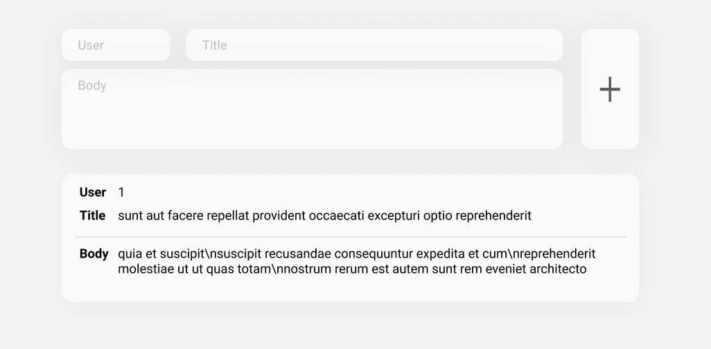
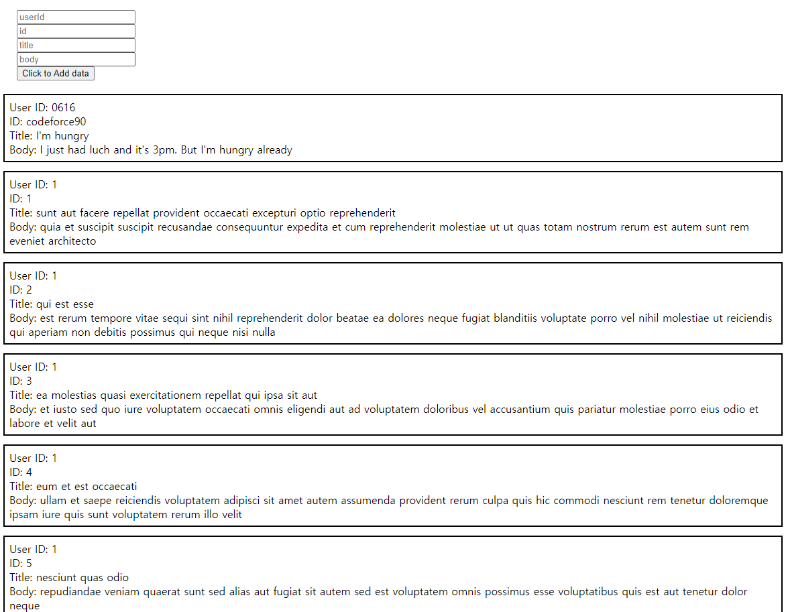

# Week 3

 
   
## Requirement   
   
   
   
Fetch data and build its data to component, sorted in user ID.   
   
Make a box of inputs with given example, and prepend a same component with its input's value by clicking a button.   
   
    
   
## Result   
   

